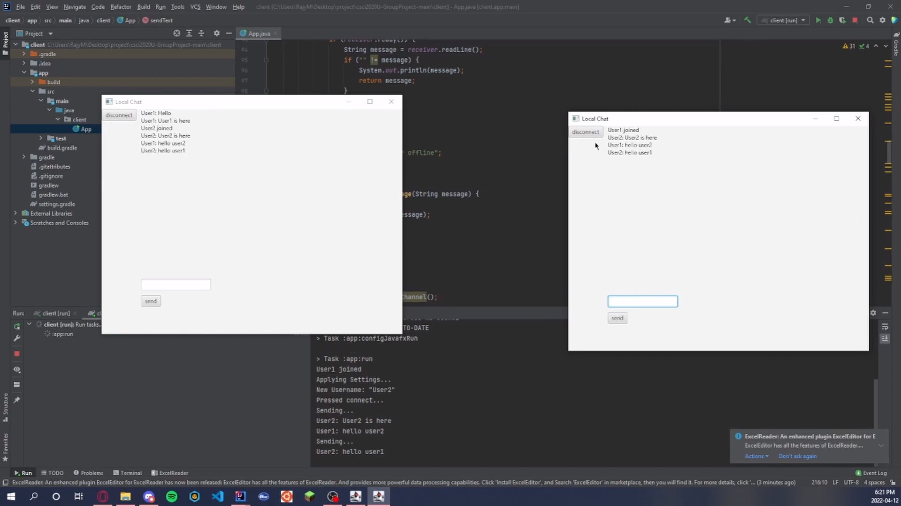

# chat_room_project

## Information
This application hosts a text based chatroom for multiple users.
It has 2 parts to it. A server side where the chatroom is created and maintained, and a client side 
where there is a UI connected to the server where users can join and text in the chatroom.

## How to Run this Application
#### Setting Up the Application:
1. Clone the project from github.
2. Open up both the client folder and server folder in IntelliJ.
 *Note: Your IntelliJ IDE must be able to run JavaFx projects, if not then ensure to set it up to be able to do so.
#### Running the Application:
3. First run the Server project. It can be done by running 
   the App.java file (server/app/src/main/java/server/__App.java__).
   Then wait for it to say "Waiting for client connection(s)..." in the terminal.
4. Next we will run the Client project, BUT before you run it make sure you can run multiple instances on your IntelliJ
   window. You can confirm this by going into the top bar,
    Run > Edit Configurations > Gradle > client \[run\] > Modify Options and check "Allow multiple instances".  
5. Run the Client project. It can be done by running the App.java file (client/app/src/main/java/client/__App.java__).
6. A local chat window (UI) will pop up, enter a username then you will enter the chatroom and can begin texting.
     *Note: The terminal will show a log of who joins, disconnects, and what messages are in the chat.
     Also, under the server terminal you can see it shows if a client is connected.
#### Stopping the Application:
7. To leave the chatroom just click on disconnect. You can enter it again by entering a username. 
8. Close the local chat window to end a client run.
9. Hit stop on the Server IntelliJ window to end the server run.

As long as the server is running feel free to play around with the application.

## Demo
Click this [link](https://www.youtube.com/watch?v=E3ZMEXWinO8) to watch a demonstration on how to run this application.
